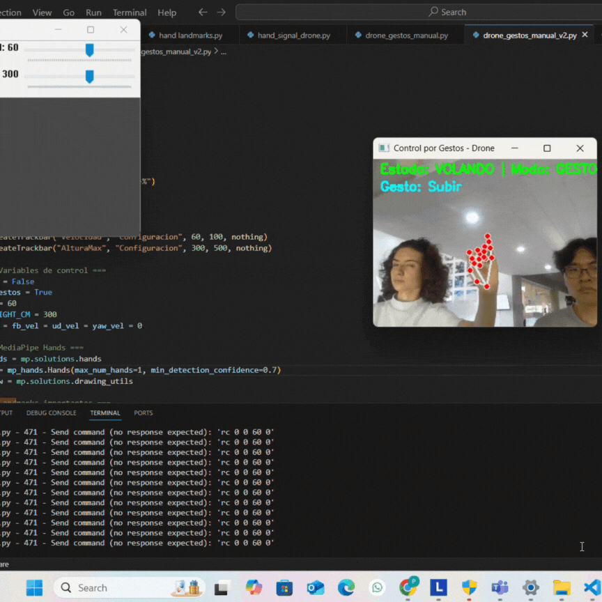

# Hand Gesture Control for DJI Tello

This project implements real-time hand gesture recognition to control a DJI Tello drone using Python, OpenCV, and MediaPipe. The system allows contactless interaction through custom-mapped gestures, triggering flight commands like takeoff, landing, movement, and rotation.

A simple graphical interface (sliders) is included to adjust parameters such as flight speed and max height during runtime.

## How It Works

- MediaPipe detects hand landmarks using a standard webcam.
- Gestures are recognized based on finger positions and combinations.
- Each gesture is mapped to a specific drone command.
- The system avoids executing any command if the gesture is unclear, ensuring safety.
- Drone state (airborne or landed) is managed via a toggle gesture (fist).

## Gesture Mapping

| Gesture               | Action             |
|-----------------------|--------------------|
| Fist                  | Toggle takeoff/landing |
| Rock & Roll           | Descend            |
| Pinky only            | Ascend             |
| Thumb + Index         | Rotate clockwise   |
| 1 finger              | Move forward       |
| 2 fingers             | Move backward      |
| 3 fingers             | Move right         |
| 4 fingers (no thumb)  | Move left          |
| Open palm             | Rotate counterclockwise |
| Unclear gesture       | Hover (no action)  |

> Note: Gestures are interpreted frame-by-frame. The drone only reacts when a valid gesture is clearly recognized.

## Key Features

- Real-time gesture recognition with MediaPipe.
- Safety-first: no command is sent if detection is ambiguous.
- Easy to extend: new gestures and commands can be added easily.
- Manual control parameters (speed, height) are adjustable via sliders.

## Preview

  

## How to Run

1. Connect your PC to the Tello drone’s Wi-Fi.
2. Run the python script
3. Use the sliders to adjust parameters

