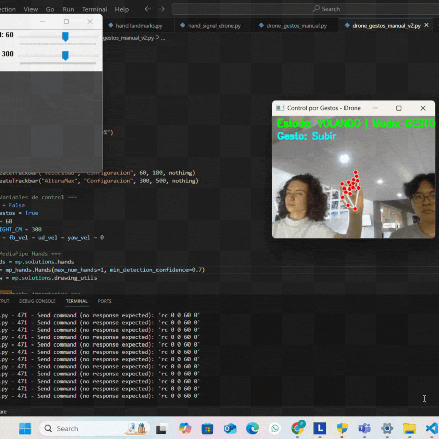

# Drone Control Projects with DJI Tello

This repository contains two hands-on projects developed with the DJI Tello drone, showcasing real-time control through computer vision and human interaction interfaces. Each system was built using Python, OpenCV, and additional libraries like MediaPipe and djitellopy to explore cyber-physical systems in practice..

## Projects

### 1. Color Tracking with PID Control
Control the drone autonomously by tracking a colored object in the camera feed. The system uses HSV filtering, real-time contour analysis, and PID controllers to keep the object centered in view.

📁 [`Color Tracking`](./ColorTracking)

  

### 2. Hand Gesture Control with MediaPipe
Use hand gestures to control the drone with no contact. MediaPipe detects hand landmarks, and predefined gestures are mapped to drone commands such as takeoff, movement, and rotation. A GUI with sliders allows real-time tuning of speed and height.

📁 [`Hand_gesture_control`](./GestureRecognition)

  

## Technologies Used

- **Python**
- **OpenCV** – Image processing and object tracking
- **MediaPipe** – Hand gesture recognition
- **djitellopy** – DJI Tello drone Python SDK
- **NumPy**
- **Tkinter** – For control interfaces (sliders)

